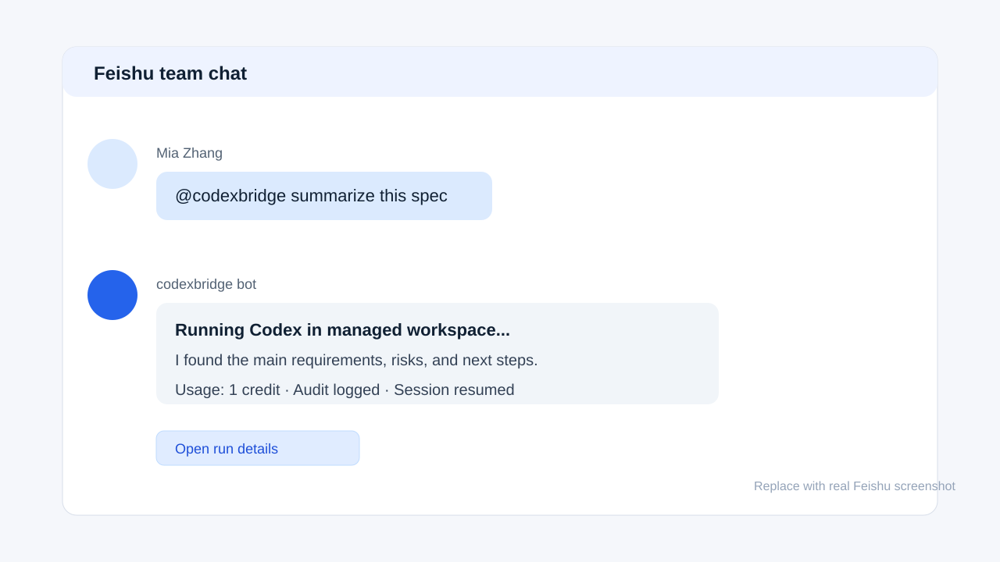
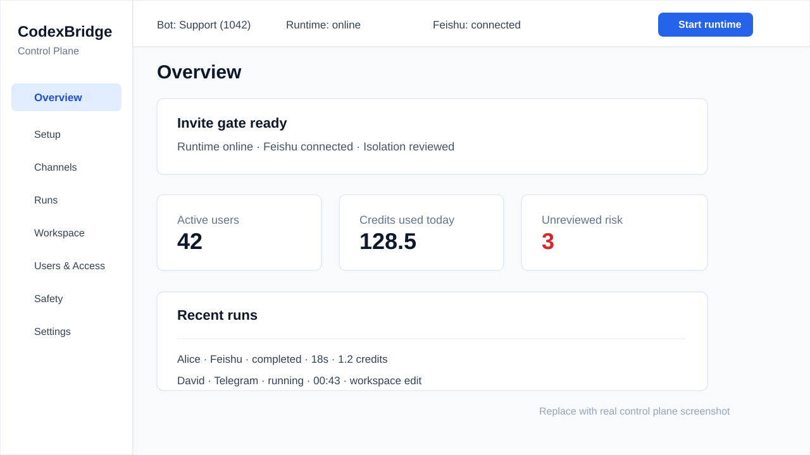
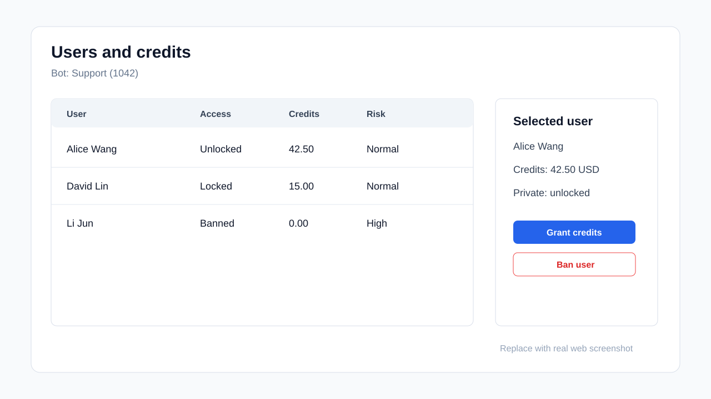
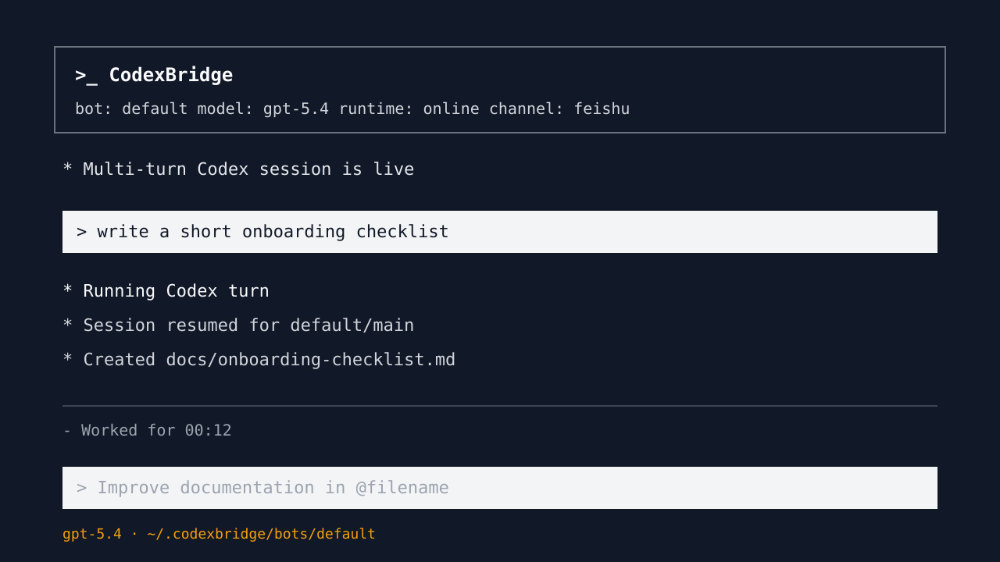

# CodexBridge

CodexBridge 把 Codex 变成可管理的团队 AI 助手入口，支持飞书、Telegram 和本地 operator 使用，并提供用户权限、积分、审计日志和持久化工作区。

语言：中文 · [English](docs/readme/README.en.md) · [Français](docs/readme/README.fr.md) · [日本語](docs/readme/README.ja.md) · [한국어](docs/readme/README.ko.md)

[快速开始](docs/getting-started.md) · [API Reference](docs/api-reference.md) · [架构](docs/current-architecture.md) · [Roadmap](ROADMAP.md) · [Telegram](docs/telegram-codex-bridge.md) · [Feishu](docs/feishu-channel-current-state.md)

[](package.json)
[](package.json)
[](LICENSE)

```text
Ask Codex:
Install Moshiii/CodexBridge from GitHub and start CodexBridge.
```

## 预览

下面是 README 需要承载的四类核心截图占位图。真实产品截图稳定后，用实际截图替换这些 placeholder。

<table>
  <tr>
    <td width="50%">
      
      <br />
      <strong>飞书团队对话</strong>
    </td>
    <td width="50%">
      
      <br />
      <strong>Web 管理控制台</strong>
    </td>
  </tr>
  <tr>
    <td width="50%">
      
      <br />
      <strong>用户与积分管理</strong>
    </td>
    <td width="50%">
      
      <br />
      <strong>本地 TUI 对话</strong>
    </td>
  </tr>
</table>

## 为什么需要 CodexBridge

Codex 在本地终端里很强，但团队需要一种更安全的方式，让其他人也能使用这份能力，同时不把 shell、主机或未受控的账号访问权直接交出去。

CodexBridge 补上的是运营管理层：

- 给用户提供飞书和 Telegram 入口
- 按 bot 管理访问权限、私聊解锁、封禁和角色
- 支持每日免费额度、付费积分、使用流水和管理员审计日志
- 为文件、记忆、会话和日志提供持久化工作区
- 通过 Web 控制台管理 runtime 状态、用户、积分、安全和工作区文件
- 为 operator 提供 Codex 风格的本地 TUI 使用体验

核心价值不是再做一个聊天窗口，而是受控分发。用户获得简单的聊天入口，operator 保留对身份、额度、成本、工作区状态和风险的控制。

## 典型场景

- **飞书团队 AI 助手**：让指定同事或群组直接请求调研、写作、总结、文件处理和任务规划。
- **受控 Codex 访问**：让他人使用 Codex-backed 工作能力，但不暴露你的终端或主机。
- **共享工作区 bot**：为不同项目、客户、团队或工作流创建独立 bot。
- **Operator 治理**：查看运行记录、管理积分、审查日志、停止 runtime，并控制外部访问。

## 快速开始

### 要求

- Node.js `>=22`
- 已安装 Codex CLI，并可通过 `codex` 命令访问
- 当前 `codexbridge tui` 需要 Rust/Cargo
- 只有接入外部聊天渠道时才需要 Telegram 或飞书凭据

### 安装

多数用户可以直接让 Codex 安装：

```text
Install Moshiii/CodexBridge from GitHub and start CodexBridge.
```

手动安装：

```bash
npm install -g github:Moshiii/CodexBridge
codexbridge
```

不要使用 `npm install -g codexbridge` 或直接 `npx codexbridge`；npm registry 上的 `codexbridge` 名称目前指向另一个包。

### 首次运行

`codexbridge` 会打开当前 bot 的 operator 菜单：

```text
CodexBridge Menu · Default (default)
Start chat with current bot
Start runtime
Switch bots
Connect Telegram or Feishu
User management
```

启动本地对话：

```bash
codexbridge tui
```

启动 Web 管理控制台：

```bash
codexbridge web
```

## 可以管理什么

CodexBridge 按 bot 将状态保存在 `~/.codexbridge/bots/<id>`。

每个 bot 都有独立的：

- 工作区和记忆文件
- 飞书和 Telegram 渠道配置
- 用户、积分、封禁和私聊权限
- 会话、运行记录、日志和审计记录
- runtime 配置和安全状态

完整设置见 [快速开始](docs/getting-started.md)。命令和本地 API 见 [API Reference](docs/api-reference.md)。

## 状态与安全

CodexBridge 目前是 alpha 阶段的开发者工具。

你需要自备已授权的 Codex/OpenAI 访问能力。CodexBridge 不是模型提供商，不是 subscription 转售层，也不是共享账号凭据的方式。它是围绕你自己已批准 runtime 的 operator-controlled gateway。

请先在本地使用，并先对可信用户测试。外部聊天访问应视为敏感能力。应用层策略不是主机级隔离。在允许不可信外部用户通过你的机器运行 Codex 之前，请使用独立 OS 用户、容器、sandbox、microVM 或 remote worker 验证硬隔离。

## 文档

- [Getting Started](docs/getting-started.md) - 安装、首次运行、TUI、Web 控制台、Telegram、飞书
- [API Reference](docs/api-reference.md) - CLI 命令和本地 Web API
- [Runtime Layout](docs/runtime-layout.md) - `~/.codexbridge` 下的文件结构
- [Current Architecture](docs/current-architecture.md) - 模块边界和 runtime 模型
- [Capability Overview](docs/codexbridge-capability-overview.md) - 当前能力面
- [Demo Workflows](docs/demo-workflows.md) - 示例任务
- [Roadmap](ROADMAP.md) - 产品与工程方向
- [Test Plan](docs/test-plan.md) - 验证方案
- [Telegram Bridge](docs/telegram-codex-bridge.md) - Telegram 渠道细节
- [Feishu Channel State](docs/feishu-channel-current-state.md) - 飞书/Lark 当前状态

## 开发

```bash
npm install
npm test
npm start
```

## 支持与安全

- Bug 和功能请求：请提交 GitHub issue。
- 安全问题：不要公开发布 secrets 或私有日志，请使用私密渠道联系维护者。
- 运营安全：邀请不可信外部用户之前，请使用硬隔离。

## License

MIT
