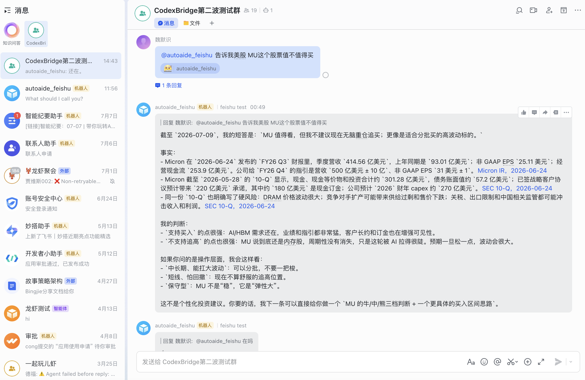
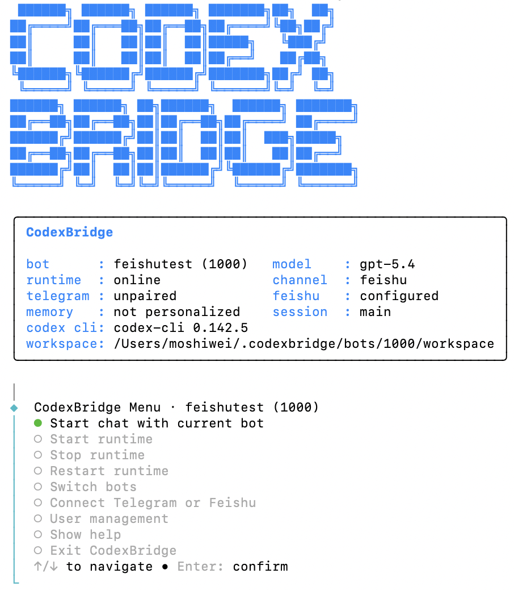

# CodexBridge

CodexBridge turns Codex into a managed team assistant for Feishu, Telegram, and local operators, with per-user access control, credits, audit logs, and persistent workspaces.

Languages: [中文](../../README.md) · English · [Français](README.fr.md) · [日本語](README.ja.md) · [한국어](README.ko.md)

[Getting Started](../getting-started.md) · [API Reference](../api-reference.md) · [Architecture](../current-architecture.md) · [Roadmap](../../ROADMAP.md) · [Telegram](../telegram-codex-bridge.md) · [Feishu](../feishu-channel-current-state.md)

[](../../package.json)
[](../../package.json)
[](../../LICENSE)

```text
Ask Codex:
Install Moshiii/CodexBridge from GitHub and start CodexBridge.
```

## Preview

Current product screenshots showing how CodexBridge distributes Codex to team users while keeping operator control over users, credits, runtimes, and workspaces.

<table>
  <tr>
    <td width="50%">
      
      <br />
      <strong>Feishu group entry point</strong>
      <br />
      <sub>Team members can call CodexBridge directly from a Feishu group.</sub>
    </td>
    <td width="50%">
      
      <br />
      <strong>Team configuration and control plane</strong>
      <br />
      <sub>Operators manage bots, runtimes, channels, and team access.</sub>
    </td>
  </tr>
  <tr>
    <td width="50%">
      
      <br />
      <strong>Local multi-turn TUI</strong>
      <br />
      <sub>Local operators can continue the same bot thread in a Codex-style terminal.</sub>
    </td>
    <td width="50%">
      
      <br />
      <strong>CLI entry and status</strong>
      <br />
      <sub>Check the active bot, runtime, channel, and workspace from the command line.</sub>
    </td>
  </tr>
</table>

## Why CodexBridge

Codex is powerful in a local terminal. Teams need a safer way to let other people use that capability without handing them a shell, a machine, or unmanaged account access.

CodexBridge adds the missing operating layer:

- Feishu and Telegram entry points for users
- Bot-scoped access control, private unlocks, bans, and roles
- Daily free quota, paid credits, usage ledger, and admin audit log
- Persistent workspaces for files, memory, sessions, and logs
- Web control plane for runtime state, users, credits, safety, and workspace files
- Local TUI for operators who want a Codex-style terminal experience

The value is managed access. Users get a simple chat interface; operators keep control over identity, quota, cost, workspace state, and risk.

## Use Cases

- **Team AI assistant in Feishu**: let selected teammates or groups ask for research, writing, summaries, file work, and task planning.
- **Controlled Codex access**: provide Codex-backed work without exposing your terminal or host directly.
- **Shared workspace bots**: create separate bots for projects, clients, teams, or workflows.
- **Operator governance**: inspect runs, manage credits, review logs, stop runtimes, and control external access.

## Quick Start

### Requirements

- Node.js `>=22`
- Codex CLI installed as `codex`
- Rust/Cargo for the current `codexbridge tui` implementation
- Telegram or Feishu credentials only if you want external chat channels

### Install

Most users can ask Codex to install it:

```text
Install Moshiii/CodexBridge from GitHub and start CodexBridge.
```

Manual install:

```bash
npm install -g github:Moshiii/CodexBridge
codexbridge
```

Do not use `npm install -g codexbridge` or plain `npx codexbridge`; the npm registry name currently points to a different package.

### First Run

`codexbridge` opens the operator menu for the active bot:

```text
CodexBridge Menu · Default (default)
Start chat with current bot
Start runtime
Switch bots
Connect Telegram or Feishu
User management
```

Start local chat:

```bash
codexbridge tui
```

Start the web control plane:

```bash
codexbridge web
```

## What You Can Manage

CodexBridge keeps state per bot under `~/.codexbridge/bots/<id>`.

Each bot has its own:

- workspace and memory files
- Feishu and Telegram channel settings
- users, credits, bans, and private access
- sessions, runs, logs, and audit records
- runtime config and safety state

For full setup details, see [Getting Started](../getting-started.md). For commands and local API endpoints, see [API Reference](../api-reference.md).

## Status And Safety

CodexBridge is an alpha developer tool.

Bring your own authorized Codex/OpenAI access. CodexBridge is not a model provider, not a subscription resale layer, and not a way to share account credentials. It is an operator-controlled gateway around your own approved runtime.

Use it locally, test with trusted users first, and treat external chat access as sensitive. Application-level policy is not host isolation. Before letting untrusted external users run Codex through your machine, verify hard isolation with a separate OS user, container, sandbox, microVM, or remote worker.

## Documentation

- [Getting Started](../getting-started.md) - install, first run, TUI, web control plane, Telegram, Feishu
- [API Reference](../api-reference.md) - CLI commands and local web API endpoints
- [Runtime Layout](../runtime-layout.md) - files under `~/.codexbridge`
- [Current Architecture](../current-architecture.md) - module boundaries and runtime model
- [Capability Overview](../codexbridge-capability-overview.md) - current feature surface
- [Demo Workflows](../demo-workflows.md) - example tasks
- [Roadmap](../../ROADMAP.md) - product and engineering direction
- [Test Plan](../test-plan.md) - validation approach
- [Telegram Bridge](../telegram-codex-bridge.md) - Telegram channel details
- [Feishu Channel State](../feishu-channel-current-state.md) - Feishu/Lark current state

## Development

```bash
npm install
npm test
npm start
```

## Support And Security

- Bugs and feature requests: open a GitHub issue.
- Security concerns: do not post secrets or private logs publicly. Open a private report or contact the maintainer directly.
- Operational safety: use hard isolation before inviting untrusted external users.

## License

MIT
